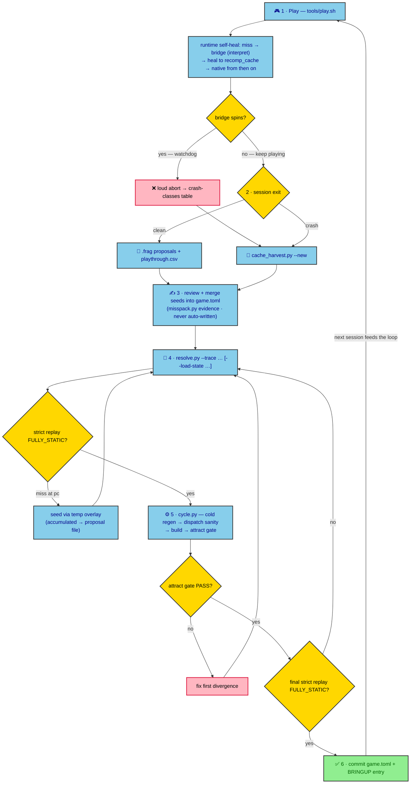

# FFTA Recomp

Native PC recompilation of **Final Fantasy Tactics Advance** (GBA, USA / AFXE)
built on the [mstan/gbarecomp](https://github.com/mstan/gbarecomp) framework.

This is not an emulator. The game's ARM/Thumb code is statically translated to
host C++ (AOT), compiled, and executed natively — with a **self-healing
coverage** loop that bridges any not-yet-translated code at runtime, records
it, and feeds it back into the offline corpus so the next build is fully
static. It is intended to be *honest*: every run reports exactly how much ran
as statically recompiled code (`self_heal_coverage=FULLY_STATIC ...` or the
precise miss count).

**Current status (2026-10-07):** boots (BIOS LLE), plays the attract loop,
title, new game, intro, and battles — the first non-tutorial battle was
completed 2026-10-07 (first event-interpreter seeds merged) — with **every
executed path FULLY_STATIC** (zero interpreted instructions) at last
verification. Fifteen interactive playtest sessions are integrated (audit
batches a–s): corpus **45,537 emitted units**, walker's static reach ≈ 98.9 %,
pointer-pool lens ≈ 86.6 % (both are proxies — the bar for a route is
FULLY_STATIC on executed paths; full table in § Verification). The attract
regression gate hash has been stable since pinning. Remaining work:
continuing past the first non-tutorial battle, a long-run attract contact
sheet, and one upstream note — see Roadmap.

> **You must own the game and BIOS.** Both are user-supplied, hash-verified at
> launch, and **never committed** (no ROM-derived bytes in git history, ever —
> that includes `generated/`, `saves/`, `logs/`, patches, and frame dumps).

- ROM: Final Fantasy Tactics Advance (USA), SHA-1
  `4ac05441f4de70a4ec3dd932116346c61b8783d9`, 16,777,216 bytes → `game.gba`
- BIOS: SHA-1 `300c20df6731a33952ded8c436f7f186d25d3492` →
  `gbarecomp/bios/gba_bios.bin` (dump your own; do not download one)

---

## Requirements

- Linux x86-64 (developed on Arch; other unixes untested)
- CMake ≥ 3.20 + Ninja, GCC or Clang (C++17), SDL2 (dev), git
- Python 3.10+ with `capstone`, installed into a repo-local `.venv/`
- Optional: a system mGBA install (`mgba-qt`) for side-by-side eyeballing

## Setup

```sh
git clone <repo-url> ffta-recompiled && cd ffta-recompiled
git submodule update --init --recursive

# Python venv for the tooling (disassembler, audit harness)
uv venv .venv && uv pip install --python .venv capstone
#   (or: python3 -m venv .venv && .venv/bin/pip install capstone)

# 1. framework tools (one-time; re-run only after submodule changes)
cmake -S gbarecomp -B gbarecomp/build -G Ninja -DCMAKE_BUILD_TYPE=Release
cmake --build gbarecomp/build --target gba_recompile gba_scan --parallel 8

# 2. place game.gba (repo root) and gbarecomp/bios/gba_bios.bin
#    (launch fails loudly if either hash is wrong)

# 3. the game binary
cmake -S . -B build -G Ninja -DCMAKE_BUILD_TYPE=Release
cmake --build build --target FFTARecomp --parallel 8

# 4. smoke: strict, headless, no input — expect FULLY_STATIC in the banner
GBARECOMP_STRICT_STATIC=1 ./build/FFTARecomp \
  --bios gbarecomp/bios/gba_bios.bin --rom game.gba --frames 2400 --no-window
```

Optional — the mGBA oracle used by the frame-diff harness (needs network
once; distinct from a system mGBA):

```sh
cd gbarecomp && bash oracle/setup-mgba.sh \
  && cmake -B build -S . -DGBARECOMP_BUILD_ORACLE=ON \
  && cmake --build build --target gbarecomp_oracle --parallel 8
```

Regeneration after `game.toml` edits (normally `tools/cycle.py` does this
plus the sanity checks and the attract gate):

```sh
./gbarecomp/build/gba_recompile --rom game.gba --config game.toml \
  --symbols symbols/ffta_symbols.tsv --data-symbols symbols/ffta_data_symbols.tsv \
  --out generated --max-functions 65536
cmake --build build --target FFTARecomp --parallel 8
```

## Run it

```sh
tools/play.sh                     # windowed, instrumented (see the loop below)
tools/play.sh --scale 8           # bigger window: Nx240 x Nx160 (1-8; 8 = 1920x1280)
tools/play.sh --fullscreen        # borderless desktop fullscreen
tools/play.sh --tcp-observe 19850 # window + live debug port (tools/keyprobe.py 19850)
./build/FFTARecomp --bios gbarecomp/bios/gba_bios.bin --rom game.gba \
  --frames 6000 --no-window       # headless; add --dump-png out.png for a frame
```

- **Keyboard:** the map lives in `build/keybinds.ini` (next to the exe; SDL
  scancode names = physical QWERTY positions). A verified all-letters example
  is `tools/playtest_keybinds.ini.example` (`a=X b=Z select=Q start=D l=W
  r=R`, arrows for the D-pad). Letters are deliberate: on desktops with an
  input-method daemon (IBus on GNOME), special keys like Enter/Backspace can
  be swallowed inside game windows.
- **Savestates:** `Shift+F1..F9` = save slot, `F1..F9` = load. Slot files are
  `game.state1..9` next to the ROM; per-session copies are archived under
  `saves/` by play.sh at launch.
- **Battery save:** Flash 64 KB at `saves/playtest.sav` (via play.sh).
- **Window size:** `--scale N` (1–8). `--view-width` is NOT a window-size
  flag — it is the widescreen *view* feature and FFTA clamps it to 240 by
  design.
- **Debug:** `--tcp` is structurally headless; use `--tcp-observe PORT` for a
  windowed session with the debug port.

## The playtest → healing loop

This is the core contribution workflow, and it is what every play session
feeds. When the game executes code that has not been statically recompiled
yet ("a miss"): the runtime **bridges** it with the reference interpreter,
**heals** it by compiling it on the fly into `recomp_cache/` (used natively
from then on), and **records a TOML proposal** for the offline corpus. A
watchdog aborts loudly if a bridge ever spins (never silent corruption).

The diagram below maps the loop end to end; the numbered steps that follow
are the same loop in prose.



**1 — Play.** `tools/play.sh [--scale 8]` and just play. The launcher
instruments everything:

| Artifact | What it is |
|---|---|
| `logs/playthrough.csv` | your exact input trace — replayable (`GBARECOMP_INPUT_REPLAY`) |
| `logs/playtest_misses.frag` | TOML proposals (`.frag` flushes **only on clean exit**) |
| `recomp_cache/<sha>/gcc/<plat>/<abi>/` | completed heals: `<PC>_<hash>_<t\|a>.{c,dll,log}` |
| `saves/` | archived previous-session savestates + traces, battery save |

**2 — Close the session.**
- Clean exit → the `.frag` holds the miss list.
- Crash → the `.frag` never flushed; recover with
  `.venv/bin/python tools/cache_harvest.py --new` (reads the heal cache
  filenames). Paste the terminal output too — abort messages name the pc.

**3 — Merge reviewed seeds** into `game.toml` (`[[extra_func]]` /
`[[jump_table]]` / `[[code_copy]]`, each with a disassembly-evidence `note`;
`tools/misspack.py <frag>` builds the evidence pack). Never auto-write
`game.toml`; proposals are reviewed.

**4 — Resolve to static.** `.venv/bin/python tools/resolve.py --trace
logs/playthrough.csv [--load-state saves/<state>] [--frames N]` — it
strict-replays your session, seeds each miss through a temporary overlay,
rebuilds and repeats until `FULLY_STATIC`, then writes the accumulated seeds
to a proposal file for merging. If you reloaded a savestate mid-session, the
trace jumps backward and replay rejects it — split it first with
`.venv/bin/python tools/trace_split.py --trace logs/playthrough.csv` and
resolve each segment from the same start state.

**5 — Verify.** `.venv/bin/python tools/cycle.py` (cold regen →
dispatch-alignment sanity → build → attract gate) and one final strict replay
of the session as the acceptance: `GBARECOMP_STRICT_STATIC=1
GBARECOMP_INPUT_REPLAY=logs/playthrough.csv ./build/FFTARecomp ...` — expect
`self_heal_coverage=FULLY_STATIC dispatch_misses=0`.

**6 — Commit** `game.toml` + a dated entry in `BRINGUP.md`. Never commit
`logs/`, `saves/`, `generated/`, or anything else ROM-derived.

**Crash classes you may meet** (all loud, all documented in `BRINGUP.md`):

| Message | Meaning |
|---|---|
| `dispatch miss for pc=… no generated function` | Normal coverage gap: bridged + healed. Feed it to the corpus. |
| `SELF-HEAL bridge for 0x… exceeded 200000000 instructions … Aborting` | Bridge stop-contract limitation (crash #1/#2 in BRINGUP). Harvest the cache, seed the path static, retry. |
| `SELF-HEAL bridge hit interpreter NotImplemented/Undefined at pc=…` | A genuine interpreter-lowering gap in gbarecomp. Report; fix belongs upstream. |

## Verification & regression

- **Strict mode** (`GBARECOMP_STRICT_STATIC=1`) disables the heal cache,
  background healing, and interpreter bridging — any miss aborts. A green
  strict run is the definition of "statically recompiled".
- **Attract gate:** `tools/attract_check.py` pins the SHA-256 of a 1200-frame
  attract run; it runs inside `cycle.py` after every `game.toml` change.
  `--repin` only for deliberate visual changes.
- **Coverage lenses:** `tools/coverage_report.py` reports executed path
  (ground truth), walker's static reach, and pointer-pool reach (a proxy —
  not a goal; FFTA needs FULLY_STATIC on executed paths, not 100 % of a
  proxy). `--json` for machine-readable output.

Current snapshot (2026-10-06, strict 1200-frame run; refresh with
`.venv/bin/python tools/coverage_report.py`):

| Lens | Mapped / total | % |
|---|---|---|
| **Executed path** (strict 1200-frame run) | everything that ran | **100 % — FULLY_STATIC, zero interpreter fallback** |
| **Walker's static reach** (whole-ROM scan trial) | **45,537 / 46,044** emitted units | **≈ 98.9 %** |
| **Pointer-pool reach** (speculative-harvest trial) | **45,537 / 52,584** | **≈ 86.6 %** |

Rows 2–3 are proxies with different denominators (no ground-truth function
inventory exists); a route is done when its replay is FULLY_STATIC. Corpus:
45,537 emitted units (interior split units + IWRAM code-copy included); the
speculative-harvest trial kept 2,078 pointer candidates out of 103,371
PC-relative literals (`false` in `game.toml` by policy).
- **Oracle frame-diff:** `tools/framediff.py --lo 4 --hi 300` (native vs the
  framework's mGBA oracle; bounded band diffs on animated content are
  expected and documented in BRINGUP § "park-phase semantics") and
  `tools/dualrun.py` for lockstep region/pixel probes.
- **Acceptance replays in the repo today:** boot → new game
  (`inputs/title_to_newgame.csv`, 6000 f), the battle continuation
  (`inputs/session2_battle_trace.csv` + a matching state), and each session's
  own trace (via `resolve.py`). All strict-clean as of the last commit.

## Repository layout

| Path | What |
|---|---|
| `game.toml` | Per-game config: identity pin + all audit seeds (evidence in `note`s) |
| `src/` | Host integration: `main.cpp`, launcher boot, stack setup |
| `generated/` | Recompiler output — gitignored, **never edited** |
| `gbarecomp/`, `recomp-ui/` | Pinned framework submodules (see `AGENTS.md` for pins) |
| `tools/` | The whole harness: `play.sh`, `resolve.py`, `cache_harvest.py`, `cycle.py`, `attract_check.py`, `misspack.py`, `coverage_report.py`, `framediff.py`, `dualrun.py`, `ringscan.py`, `keyprobe.py`, `trace_split.py`, `disarm.py`, … |
| `.agents/skills/` | Project-local agent skills — `gbarecomp-recomp-playbook`, a portable healing-loop/audit playbook with task-grouped references |
| `inputs/` | Deterministic input traces (`<frame>,0x<hex>` active-low, sticky) |
| `symbols/` | Curated symbol seeds (attributed; consumed via `--symbols`) |
| `BRINGUP.md` | Decision log — the project's memory; read it |
| `AGENTS.md` | Rules of engagement for agents; read it before changing anything |
| `ffta-bootstrap-prompt.md` | Historical origin document (the original brief) |

## Contributing

Full rules live in `AGENTS.md`; the essentials:

1. **Never guess.** Every ROM claim comes from disassembly you ran, address
   cited; every `game.toml` entry carries its evidence in `note`.
2. **Never edit `generated/`.** Curation happens in `game.toml` and `src/`.
3. **ROM hygiene.** No ROM-derived bytes in git, ever.
4. **First divergence only** when comparing against the emulator.
5. **Log decisions** in `BRINGUP.md` (date, action, result, conclusion) and
   commit after every milestone.
6. **Don't auto-write `game.toml`** — proposals are reviewed by a human/agent
   before merging.
7. Stuck three times? Stop, write the state to `BRINGUP.md`, report.

## References & attribution

- [mstan/gbarecomp](https://github.com/mstan/gbarecomp) — the recompilation
  framework (read its `PRINCIPLES.md`, `DEBUG.md`, `docs/TOML_SCHEMA.md`);
  `recomp-ui` for the launcher/runtime UI.
- Community research (used as reference only, with attribution — see
  `BRINGUP.md` studies): Data Crystal wiki (ROM/RAM maps), LeonarthCG/
  FFTA_Engine_Hacks (address index), spiiin/FFTAUtils (map-data formats),
  charlie-troy/ffta-decomp (revision-exact partial decomp; **no license —
  never ingest its sources/logs, reference only**), FFHacktics forum.

## Roadmap

1. Continue main-game content past the first non-tutorial battle (completed
   2026-10-07; play → harvest → resolve), closing Phase 5.
2. Long-run attract contact sheet (f6000+), upstream note on the bridge
   stop-contract runaway.
3. **Android port** (research done; the app shell ships inside gbarecomp).
   Note: device builds run with self-heal disabled — the static coverage this
   loop builds is its prerequisite.
4. Future enhancement candidate: true widescreen (game-owned opt-in + scene
   policy validation; currently clamped to the faithful 240×160).
