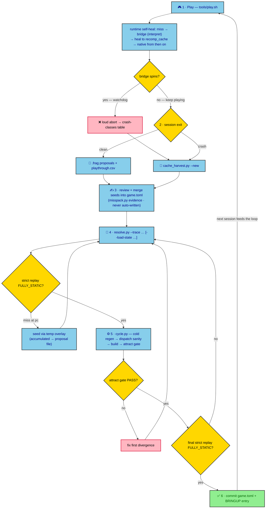

# FFTA Recomp

Native PC recompilation of **Final Fantasy Tactics Advance** (GBA, USA / AFXE)
built on the [mstan/gbarecomp](https://github.com/mstan/gbarecomp) framework.

This is not an emulator. The game's ARM/Thumb code is statically translated to
host C++ (AOT), compiled, and executed natively — with a **self-healing
coverage** loop that bridges any not-yet-translated code at runtime, records
it, and feeds it back into the offline corpus so the next build is fully
static. It is intended to be *honest*: every run reports exactly how much ran
as statically recompiled code (`self_heal_coverage=FULLY_STATIC ...` or the
precise miss count).

**Current status (2026-10-08):** boots (BIOS LLE), plays the attract loop,
title, new game, intro, battles, and now complete **Totema and magic summons**
(the save-menu/summon stalls were fixed via the LZSS-decoder entry guard +
RAM-copy fixups — BRINGUP § "Summon crash") — with **every executed path
FULLY_STATIC** (zero interpreted instructions) at last verification.
Interactive playtest sessions are integrated through the audit + event
batches (**a**–**ag**): corpus **54,355 emitted units**, walker's static
reach ≈ 97.6 %, pointer-pool lens ≈ 99.9 % (proxies — a route is done when
FULLY_STATIC on its replay). The **offline coverage push**'s goal (pool
reach) was reached deliberately via strict-push verified seeds (event-crawl
batches **af/ag**) with the attract hash byte-exact — the blind speculative
path itself stays off (interior-split hazard; re-trial gated, § Roadmap).
The attract regression gate hash has been stable since pinning. Remaining:
widescreen W1b–W3, the gated offline-push re-trial, the long-run attract
contact sheet, the upstream note, and the Android port — § Roadmap.

> **You must own the game and BIOS.** Both are user-supplied, hash-verified at
> launch, and **never committed** (no ROM-derived bytes in git history, ever —
> that includes `generated/`, `saves/`, `logs/`, patches, and frame dumps).
> No game code, graphics, text, or audio is included — this repository is
> tooling and notes only — and the project is unofficial: not affiliated with
> or endorsed by Square Enix or Nintendo.

- ROM: Final Fantasy Tactics Advance (USA), SHA-1
  `4ac05441f4de70a4ec3dd932116346c61b8783d9`, 16,777,216 bytes → `game.gba`
- BIOS: SHA-1 `300c20df6731a33952ded8c436f7f186d25d3492` →
  `gbarecomp/bios/gba_bios.bin` (dump your own; do not download one)

---

## Requirements

- Linux x86-64 (developed on Arch; other unixes untested)
- CMake ≥ 3.20 + Ninja, GCC or Clang (C++17), SDL2 (dev), git
  - Arch: `sudo pacman -S --needed cmake ninja gcc sdl2 git uv`
  - Debian/Ubuntu: `sudo apt install cmake ninja-build g++ libsdl2-dev git python3-venv`
- Python 3.10+ with `capstone`, installed into a repo-local `.venv/`
  (`uv` recommended; plain `python3 -m venv` works too)
- Your own dumps: the FFTA (USA) ROM and a GBA BIOS dump — both
  hash-verified at launch (see the block above) and never committed
- Optional: a system mGBA install (`mgba-qt`) for side-by-side eyeballing

## Setup (fresh clone → running game)

The sequence below was verified end-to-end from a fresh clone on 2026-10-08
(submodules → tools → patches → BIOS → corpus → build → strict smoke +
attract gate).

**1. Clone with submodules.**
```sh
git clone <repo-url> ffta-recompiled && cd ffta-recompiled
git submodule update --init --recursive
# If a submodule worktree comes up empty, re-run with --checkout --recursive
```

**2. Python venv for the tooling** (disassembler, audit harness):
```sh
uv venv .venv && uv pip install --python .venv capstone
#   (or: python3 -m venv .venv && .venv/bin/pip install capstone)
```

**3. Build the framework tools** (one-time; re-run only after submodule
changes):
```sh
cmake -S gbarecomp -B gbarecomp/build -G Ninja -DCMAKE_BUILD_TYPE=Release
cmake --build gbarecomp/build --target gba_recompile gba_scan --parallel 8
```

**4. Place your dumps** — `game.gba` at the repo root (FFTA USA) and
`gbarecomp/bios/gba_bios.bin` (your own BIOS dump). Launch verifies both
hashes and fails loudly if either is wrong or missing.

**5. Apply the local framework patches** (recommended — the tooling below
assumes them; diffs kept on top of the pinned submodule):
```sh
cd gbarecomp
git apply ../tools/patches/oracle-save-autoload.patch
git apply ../tools/patches/selfheal-journal-close-hardening.patch
cd ..
```
`tools/check.py --only patches` guards their validity.

**6. Recompile the BIOS (one-time).** Run it *from `gbarecomp/`* so the
output lands in `gbarecomp/src/runtime/generated_bios/`, and pass the
project's BIOS config — it seeds the 770 named BIOS functions and
identity-checks the dump (without it only 666 are discovered and strict
runs abort on a miss at pc `0x300`):
```sh
cd gbarecomp && ./build/gba_recompile --bios bios/gba_bios.bin \
  --config bios/gba_bios.toml && cd ..
```

**7. Generate the game's static code corpus** (also after every `game.toml`
change — `tools/cycle.py` wraps this with the sanity checks and the attract
gate):
```sh
./gbarecomp/build/gba_recompile --rom game.gba --config game.toml \
  --symbols symbols/ffta_symbols.tsv --data-symbols symbols/ffta_data_symbols.tsv \
  --out generated --max-functions 65536
```

**8. Configure and build the game binary:**
```sh
cmake -S . -B build -G Ninja -DCMAKE_BUILD_TYPE=Release -DGBARECOMP_ENABLE_MODS=ON
cmake --build build --target FFTARecomp --parallel 8
```

(`GBARECOMP_ENABLE_MODS=ON` links the framework's mod lifecycle APIs —
activation/reset plugins, view-width requests — used by the game's
widescreen hooks; verified gate-neutral.)

**9. Sanity.** Strict, headless, no input — expect `FULLY_STATIC` in the
banner:
```sh
GBARECOMP_STRICT_STATIC=1 ./build/FFTARecomp \
  --bios gbarecomp/bios/gba_bios.bin --rom game.gba --frames 2400 --no-window
```
And optionally the attract gate, which pins the exact frame hash:
```sh
.venv/bin/python tools/attract_check.py    # PASS + exit 0 expected
```

Then play — `tools/play.sh` (see the playtest guide below).

<details>
<summary>Troubleshooting</summary>

- `gba_recompile: command not found` → step 3 was not run in this checkout.
- `generated_bios/` stays empty / BIOS never loads → step 6 was run from the
  wrong directory (`cd gbarecomp` first). If strict runs instead abort with
  a dispatch miss near pc `0x300`, step 6 ran without
  `--config bios/gba_bios.toml`.
- Launch aborts with an identity/hash error → wrong or missing dump; compare
  the SHA-1s listed at the top of this README.
- CMake cannot find SDL2 → install the dev package (see Requirements).
- `import capstone` fails in tools → step 2's venv (use
  `.venv/bin/python tools/...`).
- A submodule directory is empty after cloning → step 1's retry line.
- Window refuses to close, or a session wedges → `tools/quit.py <port>`; see
  the playtest guide below.
- After `game.toml` edits: regenerate (step 7) → rebuild → attract gate, i.e.
  `.venv/bin/python tools/cycle.py`.

</details>

Optional — the mGBA oracle used by the frame-diff harness (needs network
once; distinct from a system mGBA):

```sh
cd gbarecomp && bash oracle/setup-mgba.sh \
  && cmake -B build -S . -DGBARECOMP_BUILD_ORACLE=ON \
  && cmake --build build --target gbarecomp_oracle --parallel 8
```

## Run it

```sh
tools/play.sh                     # windowed, instrumented — the normal way to play
tools/play.sh --scale 8           # windowed, bigger (playtest guide below)

./build/FFTARecomp --bios gbarecomp/bios/gba_bios.bin --rom game.gba \
  --frames 6000 --no-window       # headless; add --dump-png out.png for a frame
```

Headless runs are for scripts and gates; use `tools/play.sh` for anything
interactive. Session recording, controls, savestates, debug ports and clean
shutdown are covered next.

## Playtesting & debugging with `tools/play.sh`

`tools/play.sh` launches the windowed build with the session instrumentation
already on (input recording, live miss journaling, persistent battery save)
and archives the previous session's artifacts at launch, so back-to-back
playtests cannot clobber each other.

### Launch options

| Command | What you get |
|---|---|
| `tools/play.sh` | windowed game, instrumentation on |
| `tools/play.sh --scale N` | bigger window (1–8; 8 = 1920×1280) |
| `tools/play.sh --fullscreen` | borderless desktop fullscreen |
| `tools/play.sh --launcher` | run the settings UI first |
| `tools/play.sh --tcp-observe PORT` | window + read-only debug port (see below) |
| `tools/play.sh --save-path saves/copy.sav` | play a different battery save (last flag wins; work on a copy — in-game saves rewrite the file) |

Notes:
- `--tcp` (without `-observe`) is structurally headless — the TCP branch
  returns before window init. For a windowed session always use
  `--tcp-observe PORT`.
- `--view-width` is the widescreen *view* feature, not a window size — FFTA
  clamps it to 240 by design. Dev override: `GBARECOMP_WS_WIP=1` (see
  `reference/widescreen.md`).
- Extra flags pass straight through to `FFTARecomp`; the build must exist
  (`build/FFTARecomp`) before launching.

### Controls, savestates, saves

- **Keymap:** `build/keybinds.ini` (next to the exe; SDL scancode names =
  physical QWERTY positions). Install the verified all-letters example:
  `cp tools/playtest_keybinds.ini.example build/keybinds.ini`
  (`a=X b=Z select=Q start=D l=W r=R` + arrows). Letters are deliberate — on
  desktops with an input-method daemon (IBus/GNOME) Enter/Backspace can be
  swallowed inside game windows. Relaunch after edits.
- **Savestates:** `Shift+F1..F9` saves into slot 1–9; `F1..F9` loads. Slot
  files are `game.state1..9` at the repo root; play.sh archives the previous
  session's as `saves/stateN_prev_<ts>.state`.
- **Battery save:** Flash 64 KB, default `saves/playtest.sav` (see
  `--save-path` above for external saves).

### What a session records (live)

| Artifact | What it is |
|---|---|
| `logs/playthrough.csv` | exact `(frame, keys)` trace — replayable with `GBARECOMP_INPUT_REPLAY` |
| `logs/playtest_misses.frag` | TOML proposals for every code miss — journaled to disk the moment each miss is recorded (a hang or kill cannot lose it); rewritten with final counts at clean exit |
| `recomp_cache/…` | each miss healed on the fly into native code — the game keeps running; the frag is the offline seed queue |

A clean close (**ESC** in-game, or `tools/quit.py`) also flushes the exit
diagnostics. If the window ever refuses to close, `.venv/bin/python
tools/quit.py <port>` closes remotely and flushes exactly the same
artifacts.

### Debugging from a second terminal

`--tcp-observe PORT` serves a read-only debug surface to one client — keep a
single long-lived watcher per session.

| Tool | Use |
|---|---|
| `.venv/bin/python tools/keyprobe.py PORT` | live KEYINPUT monitor (active-low) — verifies host keys reach the guest. Click the window once (focus) first. |
| `.venv/bin/python tools/livewatch.py PORT` | frame-stall watchdog — snapshots registers, state hash and an IWRAM stack window to `/tmp/hang_*.json` the moment the frame counter stops advancing |
| `.venv/bin/python tools/quit.py PORT` | clean remote close (archives + flushes) |
| raw TCP reads | memory/register reads for ad-hoc questions — see `gbarecomp/TCP.md`; observe mode has no stepping |

For deeper captures (no code changes): `GBARECOMP_INSN_TRACE=1` +
`GBARECOMP_FP_SAVE=file` (per-instruction ring; query with
`tools/ringscan.py`), `GBARECOMP_WRAM_TRACE` (+`_LO`/`_HI`),
`GBARECOMP_MISS_IWRAM_DUMP` — details in `AGENTS.md`.

### Recipes

- **A hang.** Leave the window frozen and run `livewatch.py` — the snapshot
  names the pc/state. Close with `quit.py`, then reproduce offline:
  `tools/spinhunt.py <trace> <save> <frames>` bisects strict replays; the
  frag/cache shows what to seed. (Crash classes: the table in the next
  section.)
- **A missing-coverage stretch.** Just play — every miss is journaled; then
  run the healing loop below (harvest → misspack → merge → resolve →
  cycle).
- **Save flows / external saves.** Play on a copy (`--save-path`), validate
  structurally with `tools/savecheck.py`; oracle comparisons:
  `tools/dualrun.py probe saveflow`.
- **Long sessions.** Supported — present-in-place + background healing keep
  long runs stable, and the frag stays current throughout.
- **Widescreen experiments.** `GBARECOMP_WS_WIP=1 tools/play.sh --scale 4
  --view-width 320` — margins are wrapped BG columns, not content;
  `reference/widescreen.md` tracks the state of play.

### Housekeeping

- Don't run builds or second game instances while a session is live —
  background heal compilation competes for CPU.
- `logs/` and `saves/` are gitignored — never force-add session captures.
- After a session, gate the tree before calling it good:
  `.venv/bin/python tools/check.py` (see Verification & regression).

## The playtest → healing loop

This is the core contribution workflow, and it is what every play session
feeds. When the game executes code that has not been statically recompiled
yet ("a miss"): the runtime **bridges** it with the reference interpreter,
**heals** it by compiling it on the fly into `recomp_cache/` (used natively
from then on), and **records a TOML proposal** for the offline corpus. A
watchdog aborts loudly if a bridge ever spins (never silent corruption).

The diagram below maps the loop end to end; the numbered steps that follow
are the same loop in prose.



**1 — Play.** `tools/play.sh [--scale 8]` and just play. The launcher
instruments everything:

| Artifact | What it is |
|---|---|
| `logs/playthrough.csv` | your exact input trace — replayable (`GBARECOMP_INPUT_REPLAY`) |
| `logs/playtest_misses.frag` | TOML proposals — **journaled live as misses occur** (an unclean close/kill no longer loses them) and rewritten with final counts at a clean exit; play.sh archives the previous session's as `saves/frag_prev_*.frag` |
| `recomp_cache/<sha>/gcc/<plat>/<abi>/` | completed heals: `<PC>_<hash>_<t\|a>.{c,dll,log}` |
| `saves/` | archived previous-session savestates + traces, battery save |

**2 — Close the session.**
- The `.frag` is written as you play (every new miss journals the proposal),
  so both clean exits and kills/hangs leave the miss list on disk; a clean
  exit rewrites it with final counts.
- If a session still looks odd, recover the healed PCs with
  `.venv/bin/python tools/cache_harvest.py --new` (reads the heal cache
  filenames). Paste the terminal output too — abort messages name the pc.

**3 — Merge reviewed seeds** into `game.toml` (`[[extra_func]]` /
`[[jump_table]]` / `[[code_copy]]`, each with a disassembly-evidence `note`;
`tools/misspack.py <frag>` builds the evidence pack). Never auto-write
`game.toml`; proposals are reviewed.

**4 — Resolve to static.** `.venv/bin/python tools/resolve.py --trace
logs/playthrough.csv [--load-state saves/<state>] [--frames N]` — it
strict-replays your session, seeds each miss through a temporary overlay,
rebuilds and repeats until `FULLY_STATIC`, then writes the accumulated seeds
to a proposal file for merging. If you reloaded a savestate mid-session, the
trace jumps backward and replay rejects it — split it first with
`.venv/bin/python tools/trace_split.py --trace logs/playthrough.csv` and
resolve each segment from the same start state.

**5 — Verify.** `.venv/bin/python tools/cycle.py` (cold regen →
dispatch-alignment sanity → build → attract gate) and one final strict replay
of the session as the acceptance: `GBARECOMP_STRICT_STATIC=1
GBARECOMP_INPUT_REPLAY=logs/playthrough.csv ./build/FFTARecomp ...` — expect
`self_heal_coverage=FULLY_STATIC dispatch_misses=0`.

**6 — Commit** `game.toml` + a dated entry in `BRINGUP.md`. Never commit
`logs/`, `saves/`, `generated/`, or anything else ROM-derived.

**Crash classes you may meet** (all loud, all documented in `BRINGUP.md`):

| Message | Meaning |
|---|---|
| `dispatch miss for pc=… no generated function` | Normal coverage gap: bridged + healed. Feed it to the corpus. |
| `SELF-HEAL bridge for 0x… exceeded 200000000 instructions … Aborting` | Bridge stop-contract limitation (crash #1/#2 in BRINGUP). Harvest the cache, seed the path static, retry. |
| `SELF-HEAL bridge hit interpreter NotImplemented/Undefined at pc=…` | A genuine interpreter-lowering gap in gbarecomp. Report; fix belongs upstream. |

## Verification & regression

- **Strict mode** (`GBARECOMP_STRICT_STATIC=1`) disables the heal cache,
  background healing, and interpreter bridging — any miss aborts. A green
  strict run is the definition of "statically recompiled".
- **Attract gate:** `tools/attract_check.py` pins the SHA-256 of a 1200-frame
  attract run; it runs inside `cycle.py` after every `game.toml` change.
  `--repin` only for deliberate visual changes.
- **Full gate:** `.venv/bin/python tools/check.py` — host unit tests
  (C++ + Python), patch validity, the attract gate, and strict route
  replays (user
  save-load, sessions G/K) against frozen fixtures in `saves/regress/`
  (sha-pinned). Run it before declaring "no regressions"; checks run
  concurrently by default (`--jobs N`; auto = min(8, CPUs) — `--jobs 1` for
  serial) with per-run save/coverage isolation; `--fast` for the quick
  subset. `tools/savecheck.py` validates raw/RTN5 saves offline.
  The `saves/regress/` fixtures are local-only (never redistributed), so a
  fresh clone has nothing to replay: use `--only unit-cpp`,
  `--only unit-py`, `--only attract` (or `tools/attract_check.py`) until you
  have regenerated routes by playing + resolving; `--fast` also needs the
  fixture for its `savecheck` step.
- **Coverage lenses:** `tools/coverage_report.py` reports executed path
  (ground truth), walker's static reach, and pointer-pool reach (a proxy —
  not a goal; FFTA needs FULLY_STATIC on executed paths, not 100 % of a
  proxy). `--json` for machine-readable output.

Current snapshot (2026-10-08, strict 1200-frame run; refresh with
`.venv/bin/python tools/coverage_report.py`):

| Lens | Mapped / total | % |
|---|---|---|
| **Executed path** (strict 1200-frame run) | everything that ran | **100 % — FULLY_STATIC, zero interpreter fallback** |
| **Walker's static reach** (whole-ROM scan trial) | **54,355 / 55,673** emitted units | **≈ 97.6 %** |
| **Pointer-pool reach** (speculative-harvest trial) | **54,355 / 54,432** | **≈ 99.9 %** |

Rows 2–3 are proxies with different denominators (no ground-truth function
inventory exists); a route is done when its replay is FULLY_STATIC. Corpus:
54,355 emitted units (interior split units + IWRAM code-copy included); the
speculative-harvest trial kept 2,122 pointer candidates out of 104,915
PC-relative literals (`false` in `game.toml` by policy).

**Save flows — resolved (2026-10-08).** The 2026-10-07 stall/runaway class on
certain save contents was root-caused to a bug on OUR side, not a guest
divergence: the save driver re-plants its byte-copy helper per call, and a
mid-copy IRQ resume could byte-match a fresh plant and re-run the canonical
body (stack tear → the driver's epilogue popped a scan-buffer pointer as a
return address; aborts like `pc=0x02003CB0` / `0x700200F2`). The ram-dispatch
hook now passes every `r2 == 0xFFFFFFFF` resume through to the fixed table's
resume labels (commit `1eeb60f`): the save flow completes, the found-save
repro (`saves/found_save.mGBA.sav` + `saves/trace_sessionL_1736.csv`) and all
save routes replay strict-clean, and the open-bus reads the fix exposed are
oracle-identical (BRINGUP §§ cont.2–cont.4; driver-call tooling:
`tools/readseq_probe.py`). Remaining minor observation: a ~950-frame
native-vs-oracle offset for the same flow (open; no state divergence in the
compared windows).
- **Oracle frame-diff:** `tools/framediff.py --lo 4 --hi 300` (native vs the
  framework's mGBA oracle; bounded band diffs on animated content are
  expected and documented in BRINGUP § "park-phase semantics") and
  `tools/dualrun.py` for lockstep region/pixel probes.
- **Acceptance replays in the repo today:** boot → new game
  (`inputs/title_to_newgame.csv`, 6000 f), the battle continuation
  (`inputs/session2_battle_trace.csv` + a matching state), each session's
  own trace (via `resolve.py`), and the found-save load repro
  (`saves/found_save.mGBA.sav` + `saves/trace_sessionL_1736.csv`). All
  strict-clean as of the last commit.

## Repository layout

| Path | What |
|---|---|
| `game.toml` | Per-game config: identity pin + all audit seeds (evidence in `note`s) |
| `src/` | Host integration: `main.cpp`, launcher boot, stack setup |
| `tests/` | Host unit tests for `src/` custom code: `ctest --test-dir build -R ram_dispatch` (or run `./build/ffta_unit_tests` directly) |
| `generated/` | Recompiler output — gitignored, **never edited** |
| `gbarecomp/`, `recomp-ui/` | Pinned framework submodules (see `AGENTS.md` for pins) |
| `tools/` | The whole harness: `play.sh`, `check.py` (regression gate), `savecheck.py` (save validation), `resolve.py`, `cache_harvest.py`, `cycle.py`, `attract_check.py`, `misspack.py`, `coverage_report.py`, `framediff.py`, `dualrun.py`, `ringscan.py`, `keyprobe.py`, `trace_split.py`, `disarm.py`, … |
| `.agents/skills/` | Project-local agent skills — `gbarecomp-recomp-playbook`, a portable healing-loop/audit playbook with task-grouped references |
| `inputs/` | Deterministic input traces (`<frame>,0x<hex>` active-low, sticky) |
| `symbols/` | Curated symbol seeds (attributed; consumed via `--symbols`) |
| `BRINGUP.md` | Decision log — the project's memory; read it |
| `AGENTS.md` | Rules of engagement for agents; read it before changing anything |
| `ffta-bootstrap-prompt.md` | Historical origin document (the original brief) |

## Contributing

Full rules live in `AGENTS.md`; the essentials:

1. **Never guess.** Every ROM claim comes from disassembly you ran, address
   cited; every `game.toml` entry carries its evidence in `note`.
2. **Never edit `generated/`.** Curation happens in `game.toml` and `src/`.
3. **ROM hygiene.** No ROM-derived bytes in git, ever.
4. **First divergence only** when comparing against the emulator.
5. **Log decisions** in `BRINGUP.md` (date, action, result, conclusion) and
   commit after every milestone.
6. **Don't auto-write `game.toml`** — proposals are reviewed by a human/agent
   before merging.
7. Stuck three times? Stop, write the state to `BRINGUP.md`, report.

## References & attribution

- [mstan/gbarecomp](https://github.com/mstan/gbarecomp) — the recompilation
  framework (read its `PRINCIPLES.md`, `DEBUG.md`, `docs/TOML_SCHEMA.md`);
  `recomp-ui` for the launcher/runtime UI.
- Community research (used as reference only, with attribution — see
  `BRINGUP.md` studies): Data Crystal wiki (ROM/RAM maps), LeonarthCG/
  FFTA_Engine_Hacks (address index), spiiin/FFTAUtils (map-data formats),
  charlie-troy/ffta-decomp (revision-exact partial decomp; **no license —
  never ingest its sources/logs, reference only**), FFHacktics forum.
- Port credits and third-party terms: `THIRD_PARTY_ATTRIBUTION.md` (the
  `reference/datacrystal/` pages are GFDL 1.2 — license text included
  alongside them).

## Thanks

Nothing here would exist without work other people shared. Thank you to:

- **[mstan](https://github.com/mstan)** — the
  [gbarecomp](https://github.com/mstan/gbarecomp) framework and
  [recomp-ui](https://github.com/mstan/recomp-ui), plus the reference-game
  recompilations whose conventions we studied — and the R.A.I.D. community
  around them.
- **Bregalad and loveemu** — "GBA Mus Ripper" / `sappy_detector.c`, the
  basis of our m4a engine detection, with the
  [berg8793](https://github.com/berg8793/gba-mus-ripper) and
  [CaptainSwag101](https://github.com/CaptainSwag101/gba-mus-ripper) forks
  for cross-checking.
- **The [Data Crystal](https://datacrystal.tcrf.net/) contributors** — the
  FFTA ROM/RAM maps, scripting and compression pages (recovered via the
  Wayback Machine) that seeded many symbols.
- **[LeonarthCG](https://github.com/LeonarthCG)** —
  [FFTA_Engine_Hacks](https://github.com/LeonarthCG/FFTA_Engine_Hacks), the
  address index that anchored our engine studies.
- **[charlie-troy](https://github.com/charlie-troy)** —
  [ffta-decomp](https://github.com/charlie-troy/ffta-decomp), a
  revision-exact partial decomp used for naming and cross-checks.
- **[spiiin](https://github.com/spiiin)** —
  [FFTAUtils](https://github.com/spiiin/FFTAUtils), map-data formats and
  verified data regions.
- **BCROBERT, JoKyR, Terence Fergusson, and the GameFAQs code-guide authors
  (Adrammelech, labmaster, TetrisTheMovie, Vegikachu)** — the notes and
  guides that mapped FFTA's structures and formulas.
- **The [FFHacktics](https://ffhacktics.com/) community** — home of the
  long-running FFTA research that made all of this findable.
- **The [mGBA](https://mgba.io/) project** — the emulator we use as the
  differential-testing oracle.

Redistribution terms for anything included here live in
`THIRD_PARTY_ATTRIBUTION.md` and `reference/datacrystal/README.md`.

## License

The project's own code and documentation are licensed **PolyForm
Noncommercial 1.0.0** (`LICENSE`) — free to use, share, and modify for
noncommercial purposes. Third-party components keep their own terms (the
`gbarecomp` framework: PolyForm NC; `recomp-ui`: MIT;
`reference/datacrystal/`: GFDL 1.2) — see `THIRD_PARTY_ATTRIBUTION.md`.

## Roadmap

**Open / next**

1. **Widescreen — W2 milestone 1 landed (2026-10-08).** Run it:
   `--view-width 320` (default stays faithful 240). Field margins now render
   from the guest's own 512-wide ring (authored margins + OBJ native clip,
   installed via `extended_view_init`; capability declared as
   `opts.max_view_width = 320`): battle/pub margins fill 100 %, the center
   240 is pixel-identical to the faithful render, and pans keep up. World-map
   margins are its 256-px map's wrapped edge → **W3** per-scene policy
   (`extended_view_frame` seam: pillarbox menus/world map or clamp), margin
   polish, and wider validated widths. Protocol notes + EmeraldRecomp
   cross-reference: `reference/widescreen.md`.
2. **Offline coverage push — re-trial gated.** The speculative literal
   harvest reaches +4,912 units, but it split the guarded LZSS decoder at an
   interior entry (`0x08005544`): the save-menu route resumes into the
   unguarded interior, bypasses the entry check, and runs away (f17,794;
   31.8 GB RSS) — reverted, flag stays off. Condition (a), a **route-level
   golden gate**, is now satisfied: the save-menu class replays as
   first-class checks in `tools/check.py` (route_G/K). Condition (b), an
   **interior-split policy** so speculative interior roots cannot bypass
   entry guards (guard extension and/or seed exclusion), is still to design
   and is the re-trial trigger.
3. **Long-run attract contact sheet (f6000+)** and the **upstream note**
   covering the bridge stop-contract + relocated-stub resume classes (a
   gbarecomp issue).
4. **Android port** (research done; the app shell ships inside gbarecomp).
   Device builds run with self-heal disabled — the static coverage this
   loop builds is its prerequisite.
5. Optional: a mod layer from the community notes' verified hack sites
   (QoL/difficulty/test-speed); share the reverse-engineered save-record
   format when the wiki scene is reachable.

**Landed (context)**

- **Save-flow divergence — resolved 2026-10-08** (commit `1eeb60f`): the
  aborts were our ram-dispatch mid-copy re-entry, not a guest divergence;
  every save repro/route replays strict-clean (open-minor: ~950-frame
  native-vs-oracle flow offset).
- **Event/script static walk** (batches **af/ag**): scripts validated (62
  blocks / 213 scripts, no code pointers); 188 strict-push verified seeds
  from the trial literal pool lifted 50,015 → 54,327 units at landing
  (~99.9 % of the then-pool; corpus now 54,355). Tool: `tools/eventcrawl.py`
  (`--trial-dir`). Remainder: 77 pool units + walker leftovers (proxy only).
- **Annotation pass**: DataCrystal + BCROBERT + charlie-troy / engine-hacks
  material named — data regions (104 rows in `symbols/ffta_data_symbols.tsv`),
  m4a driver functions, decompressor entry corrected to `0x0801F098`
  (+ SWI thunk `0x08141868`), event-VM anchors (`symbols/ffta_symbols.tsv`
  § 5) + `reference/event-vm.md`; FAQ 26118 mine closed (all codes
  encrypted).
- **Main-game content**: battles and summons completed 2026-10-07; playtest
  sessions remain the bug-hunter and the acceptance corpus.
