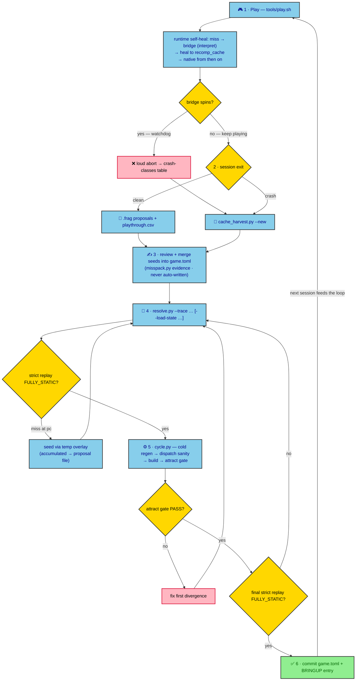

# Testing & verification — FFTA Recomp

Instrumented playtesting, the coverage/healing loop, the regression gates,
and CI. The root [README](../README.md) covers setup, building, and the
project overview; everything below assumes a built `build/FFTARecomp` and
the repo-local `.venv/`.

## Host unit tests

- **C++ (`src/` custom code, no ROM/BIOS):**
  `cmake --build build --target ffta_unit_tests && ctest --test-dir build -R ram_dispatch`
- **Python tooling:** `.venv/bin/python tests/python/test_tools.py`
  (needs capstone — the `.venv`; run by `tools/check.py --only unit-py`).
- `tools/check.py` runs both, plus the patches check, attract gate,
  widescreen smoke and strict route replays (below).

---

## Playtesting & debugging with `tools/play.sh`

`tools/play.sh` launches the windowed build with the session instrumentation
already on (input recording, live miss journaling, persistent battery save)
and archives the previous session's artifacts at launch, so back-to-back
playtests cannot clobber each other.

### Launch options

| Command | What you get |
|---|---|
| `tools/play.sh` | windowed game, instrumentation on |
| `tools/play.sh --scale N` | bigger window (1–8; 8 = 1920×1280) |
| `tools/play.sh --resize-view` | widescreen windowed — the view follows the window (up to 448 px; fixed width: `--view-width 320\|384\|448`; default stays faithful 240) |
| `tools/play.sh --fullscreen` | borderless desktop fullscreen |
| `tools/play.sh --launcher` | run the settings UI first |
| `tools/play.sh --tcp-observe PORT` | window + read-only debug port (see below) |
| `tools/play.sh --save-path saves/copy.sav` | play a different battery save (last flag wins; work on a copy — in-game saves rewrite the file) |

Notes:
- `--tcp` (without `-observe`) is structurally headless — the TCP branch
  returns before window init. For a windowed session always use
  `--tcp-observe PORT`.
- `--view-width` is the widescreen *view* feature, not a window size. FFTA
  now supports 320/384/448 (default stays faithful 240; `--resize-view`
  follows the window, windowed only). `GBARECOMP_WS_WIP` is no longer
  needed — see `reference/widescreen.md`.
- Extra flags pass straight through to `FFTARecomp`; the build must exist
  (`build/FFTARecomp`) before launching.

### Controls, savestates, saves

- **Keymap:** `build/keybinds.ini` (next to the exe; SDL scancode names =
  physical QWERTY positions). Install the verified all-letters example:
  `cp tools/playtest_keybinds.ini.example build/keybinds.ini`
  (`a=X b=Z select=Q start=D l=W r=R` + arrows). Letters are deliberate — on
  desktops with an input-method daemon (IBus/GNOME) Enter/Backspace can be
  swallowed inside game windows. Relaunch after edits.
- **Savestates:** `Shift+F1..F9` saves into slot 1–9; `F1..F9` loads. Slot
  files are `game.state1..9` at the repo root; play.sh archives the previous
  session's as `saves/stateN_prev_<ts>.state`.
- **Battery save:** Flash 64 KB, default `saves/playtest.sav` (see
  `--save-path` above for external saves).

### What a session records (live)

| Artifact | What it is |
|---|---|
| `logs/playthrough.csv` | exact `(frame, keys)` trace — replayable with `GBARECOMP_INPUT_REPLAY` |
| `logs/playtest_misses.frag` | TOML proposals for every code miss — journaled to disk the moment each miss is recorded (a hang or kill cannot lose it); rewritten with final counts at clean exit |
| `recomp_cache/…` | each miss healed on the fly into native code — the game keeps running; the frag is the offline seed queue |

A clean close (**ESC** in-game, or `tools/quit.py`) also flushes the exit
diagnostics. If the window ever refuses to close, `.venv/bin/python
tools/quit.py <port>` closes remotely and flushes exactly the same
artifacts.

### Debugging from a second terminal

`--tcp-observe PORT` serves a read-only debug surface to one client — keep a
single long-lived watcher per session.

| Tool | Use |
|---|---|
| `.venv/bin/python tools/keyprobe.py PORT` | live KEYINPUT monitor (active-low) — verifies host keys reach the guest. Click the window once (focus) first. |
| `.venv/bin/python tools/livewatch.py PORT` | frame-stall watchdog — snapshots registers, state hash and an IWRAM stack window to `/tmp/hang_*.json` the moment the frame counter stops advancing |
| `.venv/bin/python tools/hangprobe.py PORT` | read-only hang probe — registers + IF/IE/IME + FFTA wake flag + IRQ vector + miss report; safe on stalled sessions (never send `savestate_save` there — it wedges the single-client server) |
| `.venv/bin/python tools/quit.py PORT` | clean remote close (archives + flushes) |
| raw TCP reads | memory/register reads for ad-hoc questions — see `gbarecomp/TCP.md`; observe mode has no stepping |

For deeper captures (no code changes): `GBARECOMP_INSN_TRACE=1` +
`GBARECOMP_FP_SAVE=file` (per-instruction ring; query with
`tools/ringscan.py`), `GBARECOMP_WRAM_TRACE` (+`_LO`/`_HI`),
`GBARECOMP_MISS_IWRAM_DUMP` — details in `reference/dev-gotchas.md`.

### Recipes

- **A hang.** Leave the window frozen and run `livewatch.py` — the snapshot
  names the pc/state. Close with `quit.py`, then reproduce offline:
  `tools/spinhunt.py <trace> <save> <frames>` bisects strict replays; the
  frag/cache shows what to seed. (Crash classes: the table in the next
  section.) On an Android device, probe read-only first
  (`tools/hangprobe.py`) — a savestate request wedges the observe server on
  a stalled guest, and the session's `/proc` is evidence (recipe:
  `reference/dev-gotchas.md` § Android device forensics).
- **A missing-coverage stretch.** Just play — every miss is journaled; then
  run the healing loop below (harvest → misspack → merge → resolve →
  cycle).
- **Save flows / external saves.** Play on a copy (`--save-path`), validate
  structurally with `tools/savecheck.py`; oracle comparisons:
  `tools/dualrun.py probe saveflow`.
- **Long sessions.** Supported — present-in-place + background healing keep
  long runs stable, and the frag stays current throughout.
- **Widescreen.** `tools/play.sh --scale 4 --resize-view` (or
  `--view-width 448`) — ring scenes (battle/pub) fill the margins with the
  game's own field content; the world map and menus stay pillarboxed /
  native; the automated smoke test is `tools/ws_check.py`.
  `reference/widescreen.md` is the map.

### Housekeeping

- Don't run builds or second game instances while a session is live —
  background heal compilation competes for CPU.
- `logs/` and `saves/` are gitignored — never force-add session captures.
- After a session, gate the tree before calling it good:
  `.venv/bin/python tools/check.py` (see Verification & regression).

## The playtest → healing loop

This is the core contribution workflow, and it is what every play session
feeds. When the game executes code that has not been statically recompiled
yet ("a miss"): the runtime **bridges** it with the reference interpreter,
**heals** it by compiling it on the fly into `recomp_cache/` (used natively
from then on), and **records a TOML proposal** for the offline corpus. A
watchdog aborts loudly if a bridge ever spins (never silent corruption).

The diagram below maps the loop end to end; the numbered steps that follow
are the same loop in prose.

**1 — Play.** `tools/play.sh [--scale 8]` and just play. The launcher
instruments everything:

| Artifact | What it is |
|---|---|
| `logs/playthrough.csv` | your exact input trace — replayable (`GBARECOMP_INPUT_REPLAY`) |
| `logs/playtest_misses.frag` | TOML proposals — **journaled live as misses occur** (an unclean close/kill no longer loses them) and rewritten with final counts at a clean exit; play.sh archives the previous session's as `saves/frag_prev_*.frag` |
| `recomp_cache/<sha>/gcc/<plat>/<abi>/` | completed heals: `<PC>_<hash>_<t\|a>.{c,dll,log}` |
| `saves/` | archived previous-session savestates + traces, battery save |

**2 — Close the session.**
- The `.frag` is written as you play (every new miss journals the proposal),
  so both clean exits and kills/hangs leave the miss list on disk; a clean
  exit rewrites it with final counts.
- If a session still looks odd, recover the healed PCs with
  `.venv/bin/python tools/cache_harvest.py --new` (reads the heal cache
  filenames). Paste the terminal output too — abort messages name the pc.

**3 — Merge reviewed seeds** into `game.toml` (`[[extra_func]]` /
`[[jump_table]]` / `[[code_copy]]`, each with a disassembly-evidence `note`;
`tools/misspack.py <frag>` builds the evidence pack). Never auto-write
`game.toml`; proposals are reviewed.

**4 — Resolve to static.** `.venv/bin/python tools/resolve.py --trace
logs/playthrough.csv [--load-state saves/<state>] [--frames N]` — it
strict-replays your session, seeds each miss through a temporary overlay,
rebuilds and repeats until `FULLY_STATIC`, then writes the accumulated seeds
to a proposal file for merging. If you reloaded a savestate mid-session, the
trace jumps backward and replay rejects it — split it first with
`.venv/bin/python tools/trace_split.py --trace logs/playthrough.csv` and
resolve each segment from the same start state.

**5 — Verify.** `.venv/bin/python tools/cycle.py` (cold regen →
dispatch-alignment sanity → build → attract gate) and one final strict replay
of the session as the acceptance: `GBARECOMP_STRICT_STATIC=1
GBARECOMP_INPUT_REPLAY=logs/playthrough.csv ./build/FFTARecomp ...` — expect
`self_heal_coverage=FULLY_STATIC dispatch_misses=0`.

**6 — Commit** `game.toml` + a dated entry in `BRINGUP.md`. Never commit
`logs/`, `saves/`, `generated/`, or anything else ROM-derived.

**Crash classes you may meet** (all loud, all documented in `BRINGUP.md`):

| Message | Meaning |
|---|---|
| `dispatch miss for pc=… no generated function` | Normal coverage gap: bridged + healed. Feed it to the corpus. |
| `SELF-HEAL bridge for 0x… exceeded 200000000 instructions … Aborting` | Bridge stop-contract limitation (crash #1/#2 in BRINGUP). Harvest the cache, seed the path static, retry. |
| `SELF-HEAL bridge hit interpreter NotImplemented/Undefined at pc=…` | A genuine interpreter-lowering gap in gbarecomp. Report; fix belongs upstream. |

## Verification & regression

- **Strict mode** (`GBARECOMP_STRICT_STATIC=1`) disables the heal cache,
  background healing, and interpreter bridging — any miss aborts. A green
  strict run is the definition of "statically recompiled".
- **Attract gate:** `tools/attract_check.py` pins the SHA-256 of a 1200-frame
  attract run; it runs inside `cycle.py` after every `game.toml` change.
  `--repin` only for deliberate visual changes.
- **Widescreen smoke:** `tools/ws_check.py` — for each scene fixture x view
  width it compares the wide render's center against a faithful 240 render
  (must be pixel-identical), censuses the margins against the per-scene
  policy (ring scenes filled, world map pillarboxed), guards against stale
  margins (idle-vs-pan must differ), and covers the scene transitions
  (mid-fade: margins never brighter than the center; pub exit: pillarbox
  restored). Needs its dedicated sha-pinned fixture copies
  (`saves/ws_fixtures/*.state` — local-only, gitignored; exit 2 when
  missing or changed). The copies keep the player's `game.state1..9` slots
  free for GUI testing; runs in parallel (`--jobs`); 6 cases x 320/384/448
  in seconds.
- **Full gate:** `.venv/bin/python tools/check.py` — host unit tests
  (C++ + Python), patch validity, the device-free Android checks, the
  attract gate, the widescreen smoke,
  and strict route
  replays (user
  save-load, sessions G/K) against frozen fixtures in `saves/regress/`
  (sha-pinned). Run it before declaring "no regressions"; checks run
  concurrently by default (`--jobs N`; auto = min(8, CPUs) — `--jobs 1` for
  serial) with per-run save/coverage isolation; `--fast` for the quick
  subset. `tools/savecheck.py` validates raw/RTN5 saves offline.
  The `saves/regress/` fixtures are local-only (never redistributed), so a
  fresh clone has nothing to replay: use
  `--only unit-cpp,unit-py,patches,android-static` (the CI subset — no dumps
  needed) or
  `--only attract` (dumps but no fixtures) until you have regenerated routes
  by playing + resolving; `--fast` also needs the fixture for its
  `savecheck` step.
- **Coverage lenses:** `tools/coverage_report.py` reports executed path
  (ground truth), walker's static reach, and pointer-pool reach (a proxy —
  not a goal; FFTA needs FULLY_STATIC on executed paths, not 100 % of a
  proxy). `--json` for machine-readable output.
- **Android device gate:** `tools/validate_android.sh` — installs the newest
  debug APK, launches through AUTOSTART, asserts process/activity/runtime-log/
  crash health, and pulls evidence into `android/artifacts/last-run/`. Build,
  run and known device behavior: `android/README.md`; on-device forensics:
  `reference/dev-gotchas.md` § Android device forensics.
- **Android, device-free:** `tools/android_static_check.py` (suite
  `android-static`; CI tier 1) — identity/pin consistency across
  `android/app/build.gradle` / `game_android.toml` / `game.toml`, the mods
  payload contract (`state.toml` keeps widescreen enabled), tracked-file
  hygiene, and a fake-`adb` self-test of the device gate script (clean run
  passes; SELF-HEAL / missing-log / crash / setup-still-resumed runs fail).
  No SDK or device needed; guide: `android/README.md`.

Current snapshot (2026-10-08, strict 1200-frame run; refresh with
`.venv/bin/python tools/coverage_report.py`):

| Lens | Mapped / total | % |
|---|---|---|
| **Executed path** (strict 1200-frame run) | everything that ran | **100 % — FULLY_STATIC, zero interpreter fallback** |
| **Walker's static reach** (whole-ROM scan trial) | **55,103 / 56,333** emitted units | **≈ 97.8 %** |
| **Pointer-pool reach** (speculative-harvest trial) | **55,103 / 55,515** | **≈ 99.3 %** |

Rows 2–3 are proxies with different denominators (no ground-truth function
inventory exists); a route is done when its replay is FULLY_STATIC. Corpus:
55,103 emitted units (interior split units + IWRAM code-copy included); the
speculative-harvest trial kept 2,204 pointer candidates out of 105,815
PC-relative literals (`false` in `game.toml` by policy).

**Save flows — resolved (2026-10-08).** The 2026-10-07 stall/runaway class on
certain save contents was root-caused to a bug on OUR side, not a guest
divergence: the save driver re-plants its byte-copy helper per call, and a
mid-copy IRQ resume could byte-match a fresh plant and re-run the canonical
body (stack tear → the driver's epilogue popped a scan-buffer pointer as a
return address; aborts like `pc=0x02003CB0` / `0x700200F2`). The ram-dispatch
hook now passes every `r2 == 0xFFFFFFFF` resume through to the fixed table's
resume labels (commit `1eeb60f`): the save flow completes, the found-save
repro (`saves/found_save.mGBA.sav` + `saves/trace_sessionL_1736.csv`) and all
save routes replay strict-clean, and the open-bus reads the fix exposed are
oracle-identical (BRINGUP §§ cont.2–cont.4; driver-call tooling:
`tools/readseq_probe.py`). Remaining minor observation: a ~950-frame
native-vs-oracle offset for the same flow (open; no state divergence in the
compared windows).
- **Oracle frame-diff:** `tools/framediff.py --lo 4 --hi 300` (native vs the
  framework's mGBA oracle; bounded band diffs on animated content are
  expected and documented in BRINGUP § "park-phase semantics") and
  `tools/dualrun.py` for lockstep region/pixel probes.
- **Acceptance replays in the repo today:** boot → new game
  (`inputs/title_to_newgame.csv`, 6000 f), the battle continuation
  (`inputs/session2_battle_trace.csv` + a matching state), each session's
  own trace (via `resolve.py`), and the found-save load repro
  (`saves/found_save.mGBA.sav` + `saves/trace_sessionL_1736.csv`). All
  strict-clean as of the last commit.

## Continuous integration

Two tiers, split by what may leave your machine:

- **Tier 1 — `.github/workflows/ci.yml` (fork-safe, no private material).**
  Runs on GitHub-hosted runners for every push/PR: checks out the pinned
  submodules, installs the build packages, configures, and runs
  `tools/check.py --only unit-cpp,unit-py,patches,android-static` — the host
  unit tests (C++/Python), patch integrity (forward-validated against the
  pristine submodule, so it works on a fresh clone), and the device-free
  Android checks (identity pins, payload contract, tracked-file hygiene, a
  fake-`adb` self-test of the device gate script; no SDK needed). It needs no
  ROM, BIOS, or savestates, and therefore cannot run the game itself.
- **Tier 2 — the full gate (`attract`, `ws_smoke`, route replays).** Needs
  `game.gba` + BIOS + the sha-pinned local fixtures (`saves/ws_fixtures/`,
  `saves/regress/`), which are game-derived and never committed. Run it on
  a **self-hosted runner with the material pre-placed**, or a job that
  fetches a private fixture bundle under a token — gated to
  `push`/`workflow_dispatch` and **never** exposed to fork-PR workflows
  (a PR job on a runner that can read the ROM is an exfiltration path).
  The sha pins (regress save + the ws fixtures) fail loudly if the
  runner's fixtures drift.
- The **Android device gate** (`tools/validate_android.sh`) is device-bound
  and manual — no phone in CI — so it is not part of either tier (build, run
  and gate: `android/README.md`).

